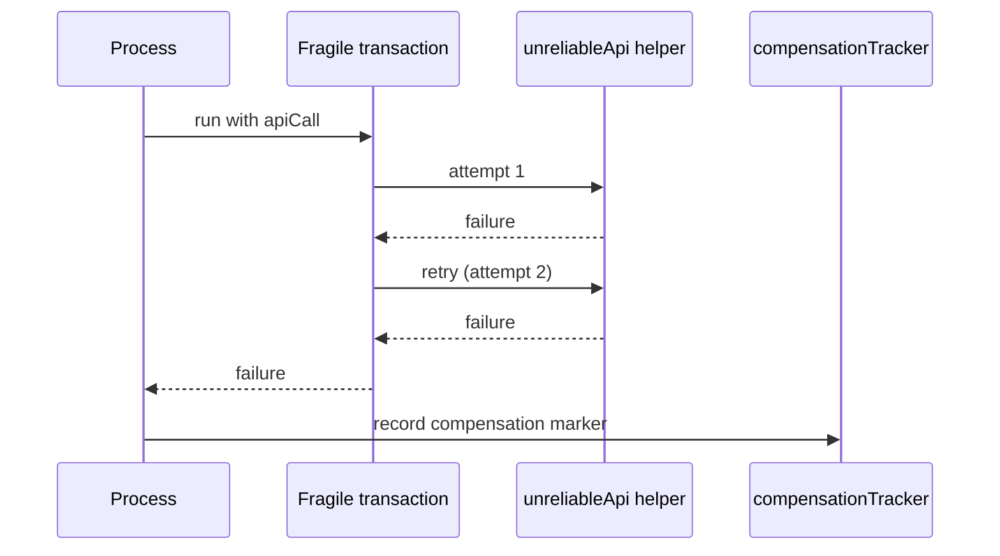

# UnreliableApiCompensated

This process shows the sad path. It sends the API call through the fragile transaction, which only retries once. If the helper still fails, the transaction fails and the process's compensation runs. The compensation records a marker via the `compensationTracker` helper so tests can verify the rollback happened.

This diagram shows two attempts, then compensation.
