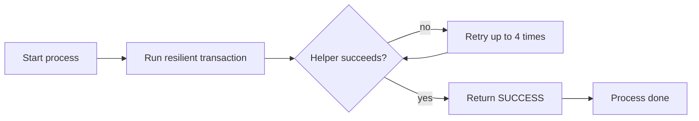

# UnreliableApiSuccess

This process is the happy path. You hand it an API call, and it passes that call to the resilient transaction. Because the resilient transaction retries several times, the helper usually succeeds on a later attempt. The process then reports `SUCCESS` and notes that retries healed the failure.

