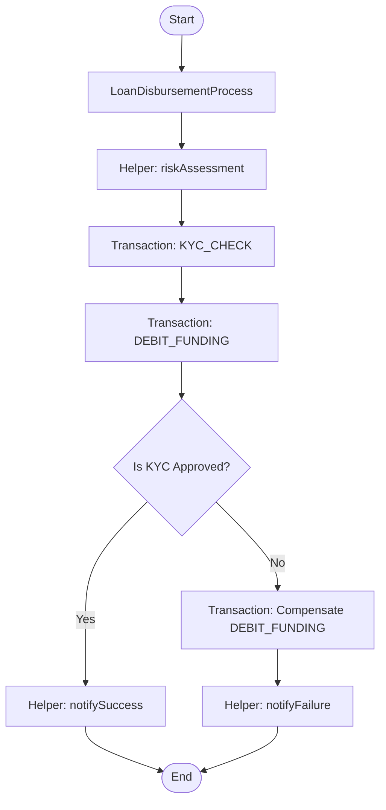
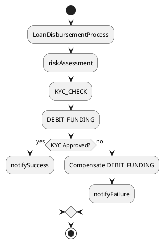

# Dry-run/Preview and Explain Modes

This document provides detailed information about the Preview (dry-run) and Explain modes of the CBS-Nova DSL Orchestration Engine, including how to use them and how to visualize their output.

## Overview

The CBS-Nova DSL Orchestration Engine supports three operational modes:

1. **Run Mode** - Executes against a live Temporal cluster (production)
2. **Preview Mode (Dry-run)** - Executes DSL definitions directly without Temporal for fast local validation
3. **Explain Mode** - Preview mode that also returns a human-readable description and diagrams

## Preview Mode (Dry-run)

### Purpose
Preview mode allows developers and business analysts to validate DSL definitions quickly without deploying to a Temporal cluster. It's ideal for:
- Fast iteration during development
- Testing business logic without infrastructure dependencies
- Validating compensation paths and error handling
- CI/CD pipeline validation

### How It Works
In Preview mode:
- The compiled `DslObject`s are executed directly using the same `Context` contract
- Helper classes and function definitions are used as-is
- `runTransaction` calls do not invoke actual Temporal activities; instead, the DSL Transaction definition is executed directly
- The entire execution runs synchronously and returns the final `Context<OUT>`
- Compensation can be simulated by throwing exceptions from selected steps

### REST Endpoint
```http
POST /api/dsl/preview/{name}
Content-Type: application/json

{
  "body": {...},                    // Input context data
  "metadata": {                     // Optional metadata
    "correlationId": "string",
    "customKey": "value"
  }
}
```

### Response
Returns the final `Context<OUT>` on success, or an error response on failure.

## Explain Mode

### Purpose
Explain mode provides detailed insights into how a DSL definition will execute, making it ideal for:
- Documentation generation
- Understanding complex workflows
- Creating visual representations for stakeholders
- Debugging execution paths
- Generating living documentation

### Output
Explain mode returns an `ExplainReport` containing:
- Natural language description of the execution flow
- Multiple diagram formats (Mermaid, PlantUML, BPMN)
- Execution trace showing step-by-step execution
- Detailed external call information
- Call counts by type

### REST Endpoint
```http
POST /api/dsl/explain/{name}
Content-Type: application/json

{
  "body": {...},                    // Input context data
  "metadata": {                     // Optional metadata
    "correlationId": "string",
    "customKey": "value"
  }
}
```

### Response Structure (ExplainReport)
```json
{
  "name": "ProcessName",
  "description": "Human-readable description of the execution flow",
  "mermaidDiagram": "Mermaid syntax diagram",
  "plantUmlDiagram": "PlantUML syntax diagram", 
  "bpmnXml": "BPMN 2.0 XML format",
  "executionTrace": [
    "started: ProcessName",
    "mode: EXPLAIN",
    "called helper: riskAssessment",
    "executed transaction: KYC_CHECK",
    // ... more trace entries
  ],
  "externalCalls": [
    {
      "type": "database",
      "target": "jdbc:postgresql://localhost:5432/mydb",
      "operation": "SELECT",
      "timestamp": 1234567890123,
      "metadata": {
        "query": "SELECT * FROM users WHERE id = ?",
        "params": [123]
      }
    }
    // ... more external calls
  ],
  "callCounts": {
    "database": 5,
    "http": 3,
    "mq": 2
  }
}
```

## Using Explain Output with JS Diagram Libraries

The Explain mode output is designed to be easily consumed by JavaScript diagram libraries for dynamic visualization:

### Mermaid.js Integration
```javascript
// Fetch explain report
const response = await fetch('/api/dsl/explain/LoanProcess', {
  method: 'POST',
  headers: { 'Content-Type': 'application/json' },
  body: JSON.stringify({ body: loanData })
});
const report = await response.json();

// Render Mermaid diagram
const mermaidElement = document.getElementById('mermaid-diagram');
mermaidElement.textContent = report.mermaidDiagram;
mermaid.init(undefined, mermaidElement);
```

### PlantUML Integration
```javascript
// For PlantUML, you typically need to send the XML to a PlantUML server
const plantumlServer = 'https://www.plantuml.com/plantuml/uml/';
const encoded = btoa(report.plantUmlDiagram); // Base64 encode
const imageUrl = plantumlServer + encoded;

const plantumlElement = document.getElementById('plantuml-diagram');
plantumlElement.innerHTML = ``;
```

### BPMN.js Integration
```javascript
// BPMN.js requires parsing the XML
import BpmnModeler from 'bpmn-js/lib/Modeler';

const bpmnElement = document.getElementById('bpmn-diagram');
const bpmnModeler = new BpmnModeler({ container: bpmnElement });

try {
  await bpmnModeler.importXML(report.bpmnXml);
  bpmnModeler.get('canvas').zoom('fit-viewport');
} catch (err) {
  console.error('Error rendering BPMN diagram:', err);
}
```

## External Call Tracking

The system automatically tracks external calls made during DSL execution, including:

### Supported Call Types
- **Database** - JDBC, JPA, Hibernate calls
- **HTTP** - RestTemplate, WebClient, HttpClient calls
- **Message Queues** - JMS, AMQP, Kafka calls
- **Microservices** - Feign, gRPC, other service-to-service calls
- **File System** - File read/write operations
- **External APIs** - Third-party service calls

### Call Details Captured
For each external call, the system records:
- **Type** - Category of call (database, http, mq, etc.)
- **Target** - Destination (URL, JDBC URL, queue name, etc.)
- **Operation** - Specific operation performed (SELECT, POST, SEND, etc.)
- **Timestamp** - When the call occurred
- **Metadata** - Additional details (query strings, payloads, headers, etc.)

### Configuration
External call tracking is automatic and requires no special configuration. However, you can:
- Register custom `ExternalCallListener` implementations for specialized handling
- Access global call counts via `ExternalCallTracker.getGlobalCounts()`
- Reset counters using `ExternalCallTracker.resetGlobalCounts()`

## Examples

### Sample Mermaid Diagram


### Sample PlantUML Diagram


### Sample BPMN XML Snippet
```xml
<bpmn:process id="Process_1" isExecutable="true">
  <bpmn:startEvent id="StartEvent_1" name="Start"/>
  <bpmn:serviceTask id="Activity_1" name="LoanDisbursementProcess"/>
  <bpmn:serviceTask id="Activity_2" name="riskAssessment"/>
  <bpmn:serviceTask id="Activity_3" name="KYC_CHECK"/>
  <bpmn:serviceTask id="Activity_4" name="DEBIT_FUNDING"/>
  <bpmn:exclusiveGateway id="Gateway_1" name="Is KYC Approved?"/>
  <bpmn:serviceTask id="Activity_5" name="notifySuccess"/>
  <bpmn:serviceTask id="Activity_6" name="Compensate DEBIT_FUNDING"/>
  <bpmn:serviceTask id="Activity_7" name="notifyFailure"/>
  <bpmn:endEvent id="EndEvent_1" name="End"/>
  <!-- Sequence flows connecting the elements -->
</bpmn:process>
```

### Sample Execution Trace
```
[
  "started: LoanDisbursementProcess",
  "mode: EXPLAIN",
  "called helper: riskAssessment",
  "executed transaction: KYC_CHECK",
  "executed transaction: DEBIT_FUNDING",
  "evaluated condition: KYC Approved?",
  "called helper: notifySuccess",
  "completed successfully"
]
```

### Sample External Calls
```json
[
  {
    "type": "database",
    "target": "jdbc:postgresql://localhost:5432/loan_db",
    "operation": "SELECT",
    "timestamp": 1720281600000,
    "metadata": {
      "query": "SELECT * FROM loan_applications WHERE id = ?",
      "params": [12345],
      "rowsAffected": 1
    }
  },
  {
    "type": "http",
    "target": "https://api.creditbureau.com/v1/score",
    "operation": "POST",
    "timestamp": 1720281601000,
    "metadata": {
      "url": "https://api.creditbureau.com/v1/score",
      "statusCode": 200,
      "responseTime": 150,
      "requestSize": 256,
      "responseSize": 1024
    }
  }
]
```

## Best Practices

### For Developers
1. Use Preview mode for rapid development cycles
2. Leverage Explain mode to generate documentation automatically
3. Monitor external call counts to understand system dependencies
4. Use the execution trace to debug complex workflows
5. Integrate diagram output into your documentation generation pipeline

### For Business Analysts
1. Use Explain mode to understand and validate business processes
2. Review the natural language description for clarity and completeness
3. Examine diagrams to identify potential bottlenecks or inefficiencies
4. Check external call counts to understand system integration points
5. Use the execution trace to verify that all expected steps occur

### For DevOps/SRE
1. Monitor external call patterns in production via Run mode tracking
2. Use Explain mode in staging to validate changes before deployment
3. Track call counts to identify unusual spikes or patterns
4. Leverage diagram generation for runbook documentation
5. Use execution traces for post-incident analysis

## Conclusion

The Preview (dry-run) and Explain modes provide powerful capabilities for developing, documenting, and understanding DSL-based orchestrations. By combining fast local execution with detailed analysis and visualization capabilities, teams can significantly improve their development velocity while maintaining high-quality, well-documented business processes.